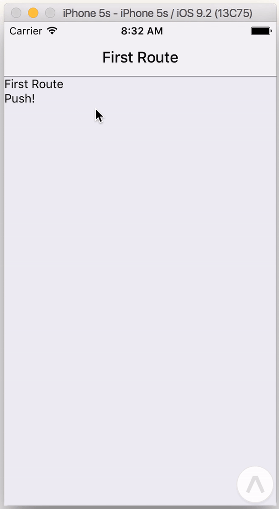

# NavigationAnimatedView

For navigation animations and gestures coordinated from javascript, you can use a `<NavigationAnimatedView>`

Most often, developers will use the animated state view with pre-built animated scenes and navigation bars:

```
<NavigationAnimatedView
  navigationState={this.props.navigationState}
  renderOverlay={(props) => (
    <NavigationHeader
      {...props}
      getTitle={route => route}
    />
  )}
  renderScene={(props) => (
    <NavigationCard
      horizontal={true}
      {...props}>
      <Text>{this.props.navigationState.get(this.props.navigationState.index)}</Text>
      <Text onPress={() => {
        this.props.onNavigation(new Navigation.Action.Push('Another Route'));
      }}>Push!</Text>
    </NavigationCard>
  )}
/>
```

This will render an animated card for each item in the navigation state, and also present a navigation header:



Custom scenes can easily be built for NavigationAnimatedView.